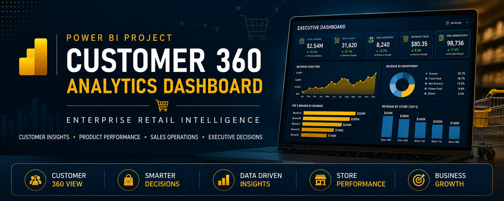

<p align="center">
  
</p>

<h1 align="center">
🛒 Customer 360 Analytics Dashboard
</h1>

<h3 align="center">
Enterprise Retail Business Intelligence Solution using Microsoft Power BI
</h3>

<p align="center">


</p>

---

<p align="center">

An enterprise-style Power BI dashboard designed to provide a **360° view of retail business performance** through executive reporting, customer analytics, product insights, and sales operations.

</p>

---
# ⭐ Project Highlights

| | |
|:---|:---|
| 📊 **5 Interactive Dashboard Pages** | Executive, Customer, Product, Sales & Insights |
| 👥 **Customer 360 Analytics** | Customer segmentation and purchasing behavior |
| 🛒 **Product Performance** | Department and brand analysis |
| 🏪 **Sales Operations** | Store performance and peak sales hours |
| 📈 **Executive Reporting** | KPI-driven business insights |
| ⚙ **Advanced DAX Measures** | Dynamic KPIs and calculations |
| 🗂 **Star Schema Model** | Optimized data model |
| 🎨 **Professional UI Design** | Executive-style dashboard layout |

---
# 📌 Project Overview

The **Customer 360 Analytics Dashboard** is an enterprise-level Business Intelligence project built using **Microsoft Power BI**.

The dashboard transforms retail transaction data into actionable business insights by combining customer analytics, product performance, sales operations, and executive reporting in a single interactive solution.

Using **Power Query**, **Star Schema data modeling**, and **DAX**, the report enables decision-makers to monitor KPIs, analyze customer purchasing behavior, evaluate product performance, identify operational trends, and support strategic business decisions through intuitive visualizations.

---
# 🎯 Business Objective

The objective of this project is to provide retail decision-makers with a centralized analytics solution that combines customer behavior, product performance, sales operations, and executive KPIs into a single interactive dashboard.

The report enables stakeholders to identify revenue drivers, understand purchasing behavior, monitor operational performance, and support data-driven business decisions.

---
# 📂 Dataset

This project is based on a retail transaction dataset containing customer, product, household, and sales information. The dataset was modeled using a Star Schema to support efficient analysis and interactive reporting.

**Dataset Includes:**
- Sales Transactions
- Product Information
- Customer & Household Data
- Calendar Data
---

# 📸 Dashboard Preview

Explore the five interactive dashboard pages included in the project.

---

## 🏠 Executive Dashboard

Executive overview of revenue, sales performance, KPIs, and departmental contribution.

Key Highlights

• Revenue KPIs

• Revenue Trend

• Department Performance

• Interactive Filters

<p align="center">


</p>

---

## 👥 Customer Analytics

Analyze customer behavior, segmentation, purchasing habits, and basket metrics.

<p align="center">


</p>

---

## 🛒 Product Performance

Monitor department performance, product contribution, discounts, and revenue distribution.

<p align="center">


</p>

---

## 🏪 Sales Operations

Evaluate store performance, weekly orders, and peak shopping hours.

<p align="center">


</p>

---

## 📈 Executive Insights

Summarizes the most important KPIs and business recommendations for decision-makers.

<p align="center">


</p>

---
# 🗂 Data Model

The dashboard follows a **Star Schema** design to ensure efficient querying, simplified relationships, and scalable report performance.

<p align="center">


</p>

### Model Highlights

- ⭐ Star Schema Architecture
- ⭐ Central Sales Fact Table
- ⭐ Optimized Relationships
- ⭐ Dedicated Measures Table
- ⭐ Scalable & Easy to Maintain

---
# 📈 Business Impact

This dashboard enables business users to:

- Monitor retail performance through executive KPIs.
- Understand customer purchasing behavior.
- Evaluate department and product contribution.
- Compare store performance.
- Identify peak shopping hours.
- Support data-driven business decisions.
---

# ✨ Dashboard Features

  ✅ Executive Dashboard

  ✅ Customer Analytics

  ✅ Product Performance

  ✅ Sales Operations

  ✅ Executive Insights

  ✅ Dynamic DAX

  ✅ Interactive Filters

  ✅ Star Schema

---
# 🛠 Tech Stack

| Tool | Purpose |
|------|---------|
| Microsoft Power BI | Dashboard Development |
| Power Query | Data Cleaning & Transformation |
| DAX | Business Logic & KPIs |
| Star Schema | Data Modeling |
| Git & GitHub | Version Control |

---
# 📁 Repository Structure

```text
Customer-360-Analytics/
│
├── Dashboard/
│   └── Customer360Analytics.pdf
│
├── Images/
│   ├── banner.png
│   ├── 01 Executive Dashboard.png
│   ├── 02 Customer Analytics.png
│   ├── 03 Product Performance.png
│   ├── 04 Sales Operations.png
│   ├── 05 Executive Insights.png
│   └── Data Model.png
│
├── README.md
│
└── LICENSE
```

---
# 🚀 Getting Started

### Prerequisites

- Microsoft Power BI Desktop

### Installation

```bash
git clone https://github.com/irshad480/Customer-360-Analytics.git
```

Open:

```text
Dashboard/Customer360Analytics.pdf
```

Refresh the data if required and explore the five interactive report pages.

---
# 💡 Skills Demonstrated

<p align="center">


</p>

---
# 👨‍💻 About the Author

**Muhammed Irshad**

Aspiring Data Analyst passionate about Business Intelligence, Power BI, Data Visualization, DAX, and Analytics.

- **GitHub:** https://github.com/irshad480
- **LinkedIn:** *(http://www.linkedin.com/in/muhammed-irshad-b21523360)*
- **Email:** *(vvrirshadmk@gmail.com)*

---
# 📄 License

This project is licensed under the **MIT License**.

See the **LICENSE** file for more information.

---

<p align="center">

### Thank you for visiting this repository!

**Built with ❤️ using Microsoft Power BI**